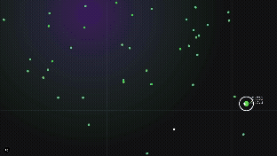

# EvoLab

**EvoLab** is an interactive evolutionary simulation running in your browser. Watch as digital organisms compete for resources, evolve unique traits, and adapt to a dynamic environment.

**Live Demo:** [https://kenoir.github.io/evolab/](https://kenoir.github.io/evolab/)



## 🧬 How It Works

EvoLab simulates a simple ecosystem based on the principles of natural selection:

1.  **Variation**: Every organism has a set of genetic traits (Speed, Size, Sense Radius, Reproduction Rate, Metabolism, etc.).
2.  **Inheritance**: When an organism accumulates enough energy, it reproduces asexually. Offspring inherit their parent's traits with slight random mutations.
3.  **Selection**: Resources are limited. Organisms must find food or hunt others to survive. Those with less effective traits die out, while successful ones propagate their genes.

## 🎮 Features

*   **Real-time Evolution**: Observe traits shifting over generations as the population adapts.
*   **Dynamic Environment**:
    *   **Food Sources**: Randomly spawning energy pellets.
    *   **Radiation Zones**: Dangerous areas that damage organisms but might force adaptation.
*   **Interactive Camera**:
    *   **Pan/Zoom**: Explore the infinite (wrapped) world.
    *   **Follow Mode**: Click any organism to track its journey.
    *   **Ambient Mode**: Hide the UI for a cinematic experience.
*   **Save & Load**:
    *   **Quick Save**: Instantly save your ecosystem to browser storage.
    *   **File Export**: Share your unique world states with others via JSON files.
*   **High Performance**: Built with a custom engine using Structure of Arrays (SoA) and spatial hashing to support thousands of entities at 60 FPS.

## 🕹️ Controls

| Action | Input |
| :--- | :--- |
| **Pan Camera** | `WASD` or `Arrow Keys` |
| **Zoom** | `Scroll Wheel` or `+` / `-` |
| **Pause / Resume** | `Spacebar` |
| **Hide UI** | `H` |
| **Spawn Food** | `Left Click` (on empty space) |
| **Select Organism** | `Left Click` (on organism) |
| **Reset World** | Button in Config Panel |

## 🛠️ Development

### Prerequisites
*   Node.js 18+
*   npm

### Setup

1.  **Clone the repository**:
    ```bash
    git clone https://github.com/kenoir/evolab.git
    cd evolab
    ```

2.  **Install dependencies**:
    ```bash
    npm install
    ```

3.  **Run the development server**:
    ```bash
    npm run dev
    ```
    Open [http://localhost:3000](http://localhost:3000) with your browser.

4.  **Run Tests**:
    ```bash
    npm test
    ```
    Includes Unit tests (Jest) and E2E tests (Playwright).

## 🏗️ Architecture

The project is built with **Next.js** and **TypeScript**, separating the simulation logic from the React UI for maximum performance.

*   **`lib/simulation/GameEngine.ts`**: The core engine. Handles physics, collision detection, genetic algorithms, and Canvas rendering. It runs outside the React render cycle.
*   **`components/Game/`**: React components for the UI overlay (Stats, Controls, Minimap).
*   **`e2e/`**: Playwright end-to-end tests.

## 📄 License

MIT License. Feel free to fork and evolve your own version!

